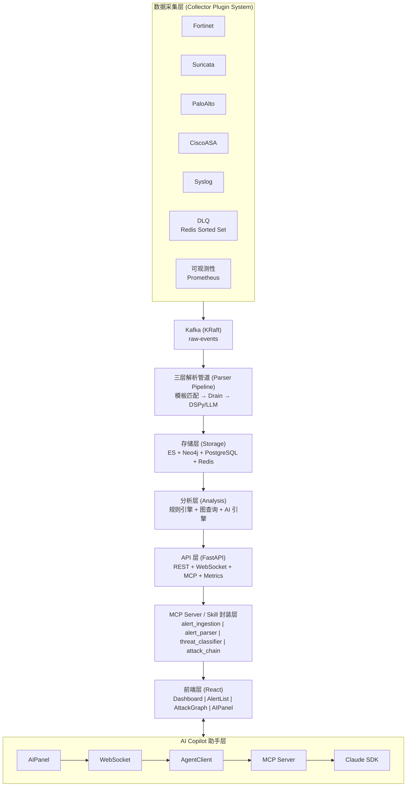
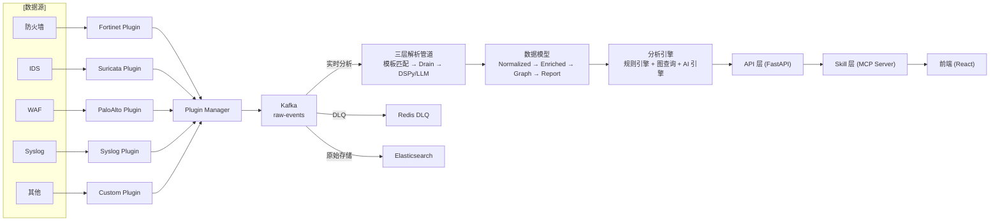
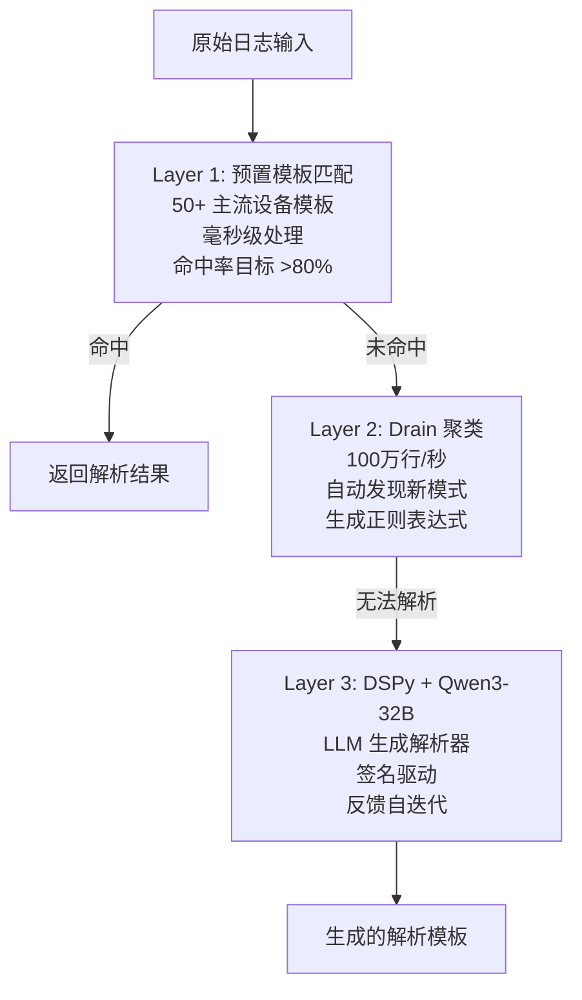
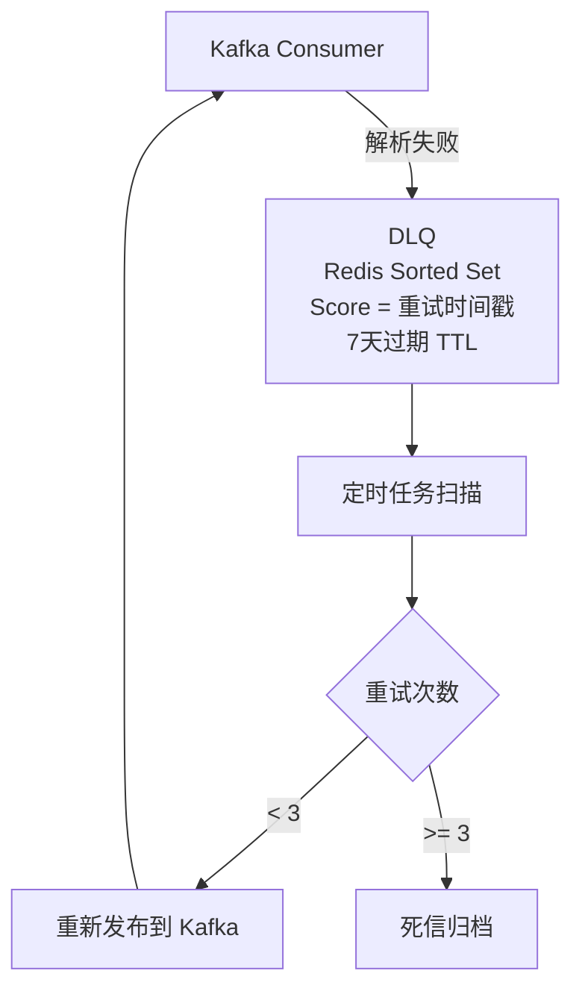
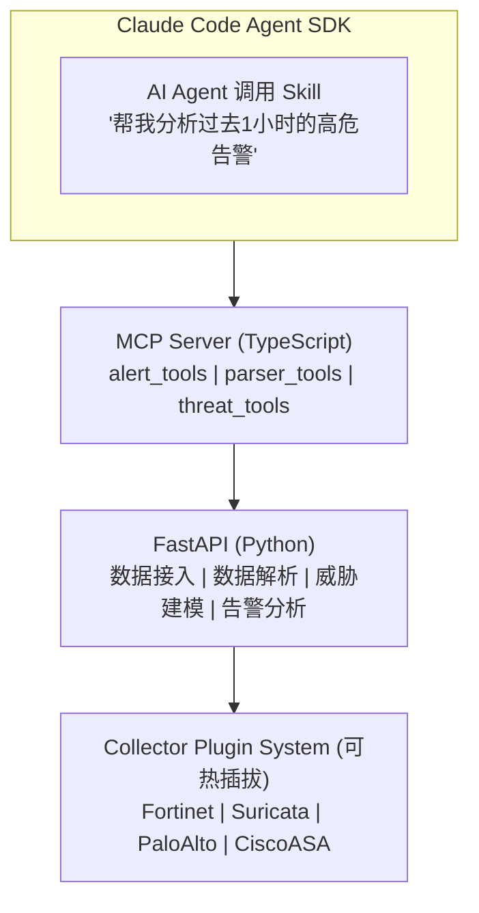
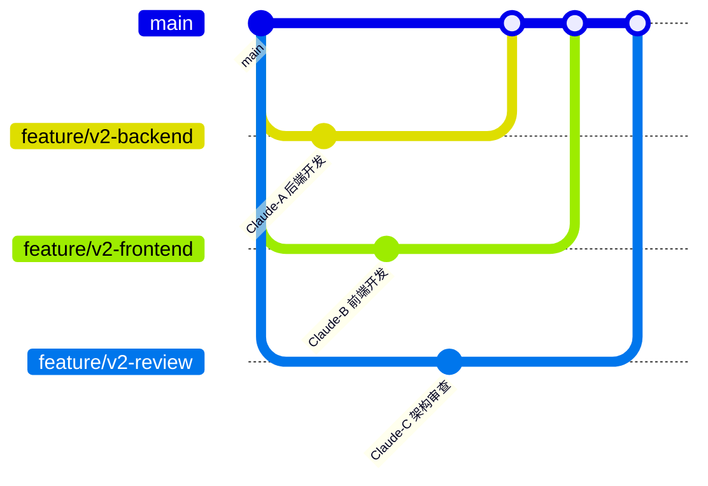

# SecAlert 智能告警分析系统 - 详细设计方案

**版本:** v2.0
**日期:** 2026-04-07
**状态:** 有效

---

[TOC]

---

## 1. 项目概述

### 1.1 项目背景

**SecAlert** 是一款面向企业普通 IT 运维人员的智能网络安全告警分析系统。系统核心价值在于帮助非安全专业背景的运维人员自动过滤海量告警，只呈现真正需要关注的安全威胁。

**核心定位：** SecAlert 的底层模块（数据接入、数据解析、威胁建模、告警分析）不仅服务于 Web UI，更应成为 **AI 原生应用** 的能力底座，通过 Skill/MCP 封装供 AI Agent 调用。

### 1.2 核心痛点

| 痛点 | 解决方案 |
|------|----------|
| 每天数万条异构安全设备告警 | 三层解析管道（模板→Drain→LLM）自动识别 |
| 误报率高（通常 70%+） | DSPy AI 引擎自动过滤误报，目标 <30% |
| 告警孤岛，无关联分析 | 基于滑动窗口的跨设备攻击链关联 |
| 非专业运维人员难以处置 | 简洁 UI + 明确处置建议 |
| 多数据源适配复杂 | 可插拔插件架构，灵活扩展 |

### 1.3 核心约束

| 约束 | 要求 |
|------|------|
| **部署模式** | 私有化离线部署，无外部云依赖 |
| **处理能力** | 每天 3 万+ 条告警，延迟可接受 |
| **硬件平台** | 支持 x86_64 和 ARM64 (鲲鹏/飞腾) |
| **用户画像** | 非专业运维人员，界面必须极度简单 |
| **AI 推理** | 所有 AI 推理基于私有化 Qwen3-32B |
| **国产化** | 支持达梦(DM)、TiDB、openGauss、Kingbase |

### 1.4 功能范围

| 已完成 (v1.0-v1.6) | 规划中 (v2.0) |
|---------------------|---------------|
| ✅ 数据采集与解析 | 📋 AI-Native Skill 封装 |
| ✅ 攻击链关联 | 📋 MCP Server 实现 |
| ✅ AI 误报过滤 | 📋 可插拔插件架构 |
| ✅ 处置建议 | 📋 ARM 完整支持 |
| ✅ 简洁 UI | 📋 Kafka KRaft 模式 |
| ✅ 数据接入 UI | 📋 国产数据库完整支持 |
| ✅ 全局元数据体系 | |
| ✅ 多渠道采集后端 | |
| ✅ DLQ 死信队列 | |
| ✅ 采集可观测性监控 | |

---

## 2. 系统架构设计

### 2.1 整体架构



### 2.2 分层职责

| 层级 | 组件 | 职责 |
|------|------|------|
| **采集层** | Collector Plugin System | 可插拔插件，多数据源适配 |
| **消息层** | Kafka (KRaft) | 事件流缓冲，解耦 |
| **解析层** | Parser Pipeline | 三层解析，格式标准化 |
| **存储层** | ES + Neo4j + PostgreSQL + Redis | 多模态存储 |
| **分析层** | Rule Engine / Graph / AI | 关联分析，AI 分类 |
| **API 层** | FastAPI | REST 接口 + WebSocket + Prometheus Metrics |
| **Skill 层** | MCP Server | AI Agent 调用封装 |
| **前端层** | React | 用户界面 |
| **AI 助手层** | AIPanel / AgentClient / MCP | 上下文感知智能辅助 |
| **可观测性层** | Prometheus / DLQ | 指标监控，死信队列处理 |

### 2.3 架构模式

采用 **AI-Native 分层架构**：

1. **采集层** 可插拔插件，灵活适配多数据源
2. **消息层** KRaft 模式，无需 Zookeeper
3. **解析层** 三层解析，格式标准化
4. **存储层** ES 全文检索，Neo4j 图关联
5. **分析层** 规则检测、图关联、AI 推理
6. **API 层** 统一接口，标准化输出
7. **Skill 层** MCP Server 封装，AI Agent 可调用
8. **前端层** 简洁 UI，人类用户交互
9. **可观测性层** 指标监控和死信处理

### 2.4 ARM 兼容性

所有组件均支持 ARM64 架构（鲲鹏/飞腾）：

| 组件 | 镜像 | ARM 状态 |
|------|------|----------|
| Kafka | apache/kafka:3.7.0 | ✅ 支持 |
| Elasticsearch | elasticsearch:8.11.0 | ✅ 支持 |
| Neo4j | neo4j:5.18 | ✅ 支持 |
| PostgreSQL | postgres:16-alpine | ✅ 支持 |
| Redis | redis:7-alpine | ✅ 支持 |
| Vector | timberio/vector:0.40.0-alpine | ✅ 支持 |

---

## 3. 技术栈详细设计

### 3.1 后端技术栈

| 组件 | 技术选型 | 版本 | 用途 |
|------|----------|------|------|
| **语言** | Python | 3.10+ | 主开发语言 |
| **AI 框架** | DSPy | 2.0+ | 签名驱动的 LLM 编程 |
| **LLM 推理** | vLLM + Qwen3-32B | 0.3+ | 离线 AI 推理 |
| **提示优化** | MIPRO | - | Bayesian prompt 优化 |
| **API 框架** | FastAPI | 0.104+ | REST API |
| **验证** | Pydantic | 2.0+ | 数据模型验证 |
| **消息队列** | Apache Kafka (KRaft) | 3.7.0 | 事件流处理，ARM 支持 |
| **图数据库** | Neo4j | 5.18 | 实体关系存储，ARM 支持 |
| **全文检索** | Elasticsearch | 8.11 | 日志检索，ARM 支持 |
| **缓存** | Redis | 7-alpine | 去重/缓存/DLQ，ARM 支持 |
| **关系数据库** | PostgreSQL | 16-alpine | 告警存储，ARM 支持 |
| **数据采集** | Vector | 0.40+ | 统一采集，Rust 原生 ARM |
| **可观测性** | Prometheus | - | Metrics 暴露 |
| **死信队列** | Redis Sorted Set | - | DLQ 重试队列 |
| **国产数据库** | 达梦/TiDB/openGauss/Kingbase | - | 国产化支持 |

### 3.2 前端技术栈

| 组件 | 技术选型 | 版本 | 用途 |
|------|----------|------|------|
| **框架** | React | 18+ | UI 框架 |
| **构建** | Vite | - | 开发服务器和构建 |
| **路由** | React Router | 6+ | 页面导航 |
| **状态管理** | Zustand | - | 前端状态 |
| **数据获取** | TanStack Query | - | API 数据缓存 |
| **UI 组件** | Radix UI + shadcn | - | 基础组件 |
| **样式** | Tailwind CSS | - | 原子化 CSS |
| **图表** | Recharts | - | 数据可视化 |
| **图可视化** | @xyflow/react | - | 攻击图 |
| **表单** | React Hook Form + Zod | - | 表单验证 |
| **类型** | TypeScript | 5+ | 类型安全 |

### 3.3 基础设施（ARM 兼容）

| 组件 | 镜像 | 端口 | ARM 状态 |
|------|------|------|----------|
| Kafka | apache/kafka:3.7.0 | 9092, 29092 | ✅ 支持 |
| Elasticsearch | elasticsearch:8.11.0 | 9200 | ✅ 支持 |
| Neo4j | neo4j:5.18 | 7474, 7687 | ✅ 支持 |
| PostgreSQL | postgres:16-alpine | 5432 | ✅ 支持 |
| Redis | redis:7-alpine | 6379 | ✅ 支持 |
| Vector | timberio/vector:0.40.0-alpine | 514, 515, 9001 | ✅ 支持 |
| Prometheus | prom/prometheus:latest | 9090 | ✅ 支持 |

---

## 4. 数据流设计

### 4.1 完整数据流



### 4.2 数据模型

| 层级 | 格式 | 存储 | 内容 |
|------|------|------|------|
| **Normalized** | OCSF/ECS | Elasticsearch | 标准化字段，全文检索 |
| **Enriched** | OCSF + 情报 | Elasticsearch | +威胁情报标签 + ATT&CK 技术映射 |
| **Graph** | 实体关系 | Neo4j | 实体节点 + 时序边 + 攻击链 |
| **Report** | 处置建议 | PostgreSQL | 告警处置记录 |

### 4.3 OCSF 数据模型

```python
# OCSF (Open Cybersecurity Schema Framework) 标准事件格式
{
    "metadata": {
        "uid": "alert-uuid-xxx",
        "event_time": "2026-04-01T10:30:00Z",
        "event_type": "network_security",
        "product": {"name": "Fortinet", "vendor": "Fortinet"}
    },
    "severity": "High",
    "severity_id": 3,
    "status": "detected",
    "status_code": 1,
    "source": {
        "ip": "192.168.1.100",
        "port": 443,
        "geo": {"country": "CN"}
    },
    "destination": {
        "ip": "10.0.0.50",
        "port": 3389,
        "geo": {"country": "CN"}
    },
    "attack": {
        "technique": "T1021",  # ATT&CK technique
        "tactics": ["lateral_movement"],
        "confidence": 0.85
    }
}
```

---

## 5. 核心模块设计

### 5.1 插件系统 (Collector Plugin System)

**位置:** `collector/plugins/`

```
collector/
├── plugins/                 # 插件目录
│   ├── base.py             # 插件基类 (CollectorPlugin)
│   ├── plugin_manager.py    # 插件管理器
│   ├── fortinet.py         # Fortinet 防火墙插件
│   ├── suricata.py         # Suricata IDS 插件
│   ├── palo_alto.py        # Palo Alto 插件
│   ├── cisco_asa.py        # Cisco ASA 插件
│   ├── syslog.py           # Syslog 通用插件
│   ├── check_point.py      # Check Point 插件
│   └── snort.py            # Snort IDS 插件
├── config/
│   └── plugins.yaml        # 插件配置
└── __init__.py
```

**插件接口定义:**

```python
# collector/plugins/base.py
from abc import ABC, abstractmethod
from dataclasses import dataclass
from typing import List, Dict, Any, Optional

@dataclass
class RawEvent:
    """原始事件"""
    uid: str                              # 事件唯一 ID
    timestamp: str                        # ISO 格式时间戳
    source_type: str                      # 数据源类型
    source_name: str                      # 数据源名称
    raw_content: str                      # 原始内容
    format_type: str                      # 格式类型: cef, syslog, json, etc.
    metadata: Dict[str, Any]              # 额外元数据

class CollectorPlugin(ABC):
    """数据采集插件接口"""
    
    @property
    @abstractmethod
    def name(self) -> str:
        """插件名称（唯一标识）"""
        pass
    
    @property
    def supported_types(self) -> List[str]:
        """支持的设备/数据源类型"""
        return [self.name]
    
    @property
    def version(self) -> str:
        """插件版本"""
        return "1.0.0"
    
    @abstractmethod
    async def collect(self) -> List[RawEvent]:
        """采集数据，返回原始事件列表"""
        pass
    
    @abstractmethod
    async def validate_config(self, config: Dict[str, Any]) -> bool:
        """验证插件配置，返回是否有效"""
        pass
    
    async def initialize(self, config: Dict[str, Any]):
        """初始化插件（可选实现）"""
        pass
    
    async def shutdown(self):
        """关闭插件（可选实现）"""
        pass
```

**插件管理器:**

```python
# collector/plugins/plugin_manager.py
class PluginManager:
    """插件管理器"""
    
    def __init__(self):
        self._plugins: Dict[str, CollectorPlugin] = {}
        self._logger = get_logger(__name__)
    
    def register(self, plugin: CollectorPlugin):
        """注册插件"""
        if plugin.name in self._plugins:
            raise ValueError(f"Plugin {plugin.name} already registered")
        self._plugins[plugin.name] = plugin
        self._logger.info(f"Registered plugin: {plugin.name}")
    
    def get_plugin(self, name: str) -> Optional[CollectorPlugin]:
        """获取插件"""
        return self._plugins.get(name)
    
    def list_plugins(self) -> List[str]:
        """列出所有已注册插件"""
        return list(self._plugins.keys())
    
    async def collect_all(self) -> List[RawEvent]:
        """采集所有插件的数据"""
        all_events = []
        for plugin in self._plugins.values():
            try:
                events = await plugin.collect()
                all_events.extend(events)
            except Exception as e:
                self._logger.error(f"Plugin {plugin.name} collect failed: {e}")
        return all_events
```

**插件配置:**

```yaml
# collector/config/plugins.yaml
collector:
  plugins:
    enabled:
      - fortinet
      - suricata
      - palo_alto
      - cisco_asa
      - syslog
    
    fortinet:
      enabled: true
      host: "${FORTINET_HOST}"
      api_token: "${FORTINET_API_TOKEN}"
      interval_seconds: 60
    
    suricata:
      enabled: true
      eve_json_path: "/var/log/suricata/eve.json"
      position_file: "/var/lib/suricata/eve.json.pos"
      interval_seconds: 10
    
    palo_alto:
      enabled: true
      host: "${PaloAlto_HOST}"
      api_key: "${PaloAlto_API_KEY}"
      interval_seconds: 60
```

**内置插件清单:**

| 插件名称 | 支持类型 | 协议/格式 |
|----------|----------|-----------|
| `fortinet` | FortiGate, FortiOS | REST API |
| `suricata` | Suricata IDS | EVE.JSON |
| `palo_alto` | Palo Alto PAN-OS | REST API |
| `cisco_asa` | Cisco ASA | Syslog |
| `syslog` | 通用 Syslog | RFC3164/RFC5424 |
| `check_point` | Check Point | Syslog |
| `snort` | Snort IDS | Unified2 |

---

### 5.2 三层解析模块 (Parser)

**位置:** `parser/`

```
parser/
├── pipeline.py          # 解析管道入口
├── registry.py          # 解析器注册表
├── templates/           # 预置解析模板 (50+)
│   ├── fortinet.yaml
│   ├── palo_alto.yaml
│   ├── cisco_asa.yaml
│   ├── suricata.yaml
│   └── ...
├── drain/               # Drain 聚类引擎
│   └── drain.py
└── dspy/               # DSPy LLM 解析器
    ├── signatures/      # DSPy 签名定义
    │   └── parse.py
    └── programs/       # DSPy 程序实现
        └── log_parser.py
```

**三层解析流程:**



---

### 5.3 攻击链关联模块 (Chain)

**位置:** `src/chain/`

```
src/chain/
├── attack_chain/        # 攻击链
│   ├── models.py        # 攻击链数据模型
│   └── service.py        # 攻击链服务
├── engine/              # 关联引擎
│   ├── correlator.py    # 告警关联器
│   └── window.py        # 滑动窗口
├── kafka_consumer.py    # Kafka 消费者
├── mitre/               # MITRE ATT&CK
│   ├── mapper.py        # 技术映射
│   └── tactics.py       # 战术分类
└── rules/               # 关联规则
    └── correlation_rules.yaml
```

---

### 5.4 AI 分析模块 (Analysis)

**位置:** `src/analysis/`

```
src/analysis/
├── service.py           # 分析服务入口
├── api.py               # 分析 API
├── classifier/          # 分类器
│   ├── dspy_classifier.py
│   └── signatures.py
├── metrics.py           # 指标计算
├── llm_config.py       # LLM 配置
├── remediation/         # 处置建议
│   ├── engine.py
│   └── templates/
└── report_aggregator.py
```

---

### 5.5 图数据库模块 (Graph)

**位置:** `src/graph/`

```
src/graph/
├── client.py           # Neo4j 客户端
└── queries/            # Cypher 查询
    ├── attack_chain.cypher
    ├── entity_relation.cypher
    └── path_finding.cypher
```

**Neo4j 数据模型:**

```cypher
// 节点类型
(:Alert {id, severity, timestamp, is_fp})
(:Host {ip, hostname, os, assets})
(:Network {ip, geo, is_malicious})
(:AttackChain {id, start_time, end_time, status})
(:MITRETactic {name, id})
(:MITRETechnique {id, name})

// 关系类型
(Alert)-[:TARGETS]->(Host)
(Alert)-[:FROM]->(Network)
(Alert)-[:BELONGS_TO]->(AttackChain)
(Alert)-[:USES_TECHNIQUE]->(MITRETechnique)
(MITRETechnique)-[:BELONGS_TO]->(MITRETactic)
(AttackChain)-[:INVOLVES]->(Host)
```

---

### 5.6 DLQ 死信队列设计



Redis Sorted Set 用法：
- Key: `dlq:events`
- Score: 下次重试时间戳 (Unix epoch)
- Member: 原始消息 JSON
- TTL: 7 天自动过期

---

### 5.7 Prometheus Metrics

| 指标名称 | 类型 | 标签 | 说明 |
|----------|------|------|------|
| `secalert_alerts_ingested_total` | Counter | source, severity | 总摄入告警数 |
| `secalert_ingestion_lag_seconds` | Histogram | source | 采集延迟分布 |
| `secalert_parsing_success_total` | Counter | parser_type | 解析成功数 |
| `secalert_parsing_failure_total` | Counter | parser_type, error_type | 解析失败数 |
| `secalert_dlq_size` | Gauge | topic | DLQ 当前堆积数 |
| `secalert_dlq_retry_total` | Counter | topic | DLQ 重试次数 |
| `secalert_eps` | Gauge | - | 当前 EPS |

**Metrics 端点:** `GET /metrics`

---

## 6. AI 助手系统设计

### 6.1 AI-Native 架构

**核心理念：** SecAlert 底层模块不仅是 Web UI 的后端，更是 AI Agent 的能力底座。



### 6.2 Skill 封装

每个底层模块封装为可被 AI Agent 调用的 Skill：

```typescript
// SecAlert Skills for AI Agent

// Skill 1: 告警接入
const alertIngestionSkill = {
  name: "alert_ingestion",
  description: "接收并处理原始安全告警",
  input: {
    device: "string",
    raw: "string",
    format: "string"
  },
  output: {
    event_id: "string",
    normalized: "object",
    confidence: "number"
  }
};

// Skill 2: 告警解析
const alertParserSkill = {
  name: "alert_parser",
  description: "解析异构告警格式",
  input: {
    format: "cef | syslog | json | custom",
    raw: "string"
  },
  output: {
    parsed: "object",
    confidence: "number",
    matched_template: "string | null"
  }
};

// Skill 3: 威胁分类
const threatClassifierSkill = {
  name: "threat_classifier",
  description: "判断威胁类型和严重度",
  input: {
    alert: "object"
  },
  output: {
    threat_type: "string",
    severity: "Critical | High | Medium | Low",
    confidence: "number",
    mitre_techniques: "string[]"
  }
};

// Skill 4: 误报检测
const falsePositiveDetectorSkill = {
  name: "false_positive_detector",
  description: "检测误报",
  input: {
    alert: "object"
  },
  output: {
    is_false_positive: "boolean",
    reason: "string",
    confidence: "number"
  }
};

// Skill 5: 攻击链构建
const attackChainBuilderSkill = {
  name: "attack_chain_builder",
  description: "还原攻击链",
  input: {
    alert_ids: "string[]",
    time_window_seconds: "number"
  },
  output: {
    chain_id: "string",
    steps: "object[]",
    attack_path: "object"
  }
};

// Skill 6: 处置建议
const remediationSkill = {
  name: "remediation",
  description: "生成处置建议",
  input: {
    alert: "object",
    threat_type: "string"
  },
  output: {
    actions: "string[]",
    priority: "number",
    estimated_time: "string"
  }
};
```

### 6.3 MCP Server 实现

```typescript
// src/mcp/server.ts
import { createServer, Tool } from '@modelcontextprotocol/sdk/server';
import { queryAlerts } from './tools/query_alerts';
import { parseAlert } from './tools/parse_alert';
import { classifyThreat } from './tools/classify_threat';
import { buildAttackChain } from './tools/build_attack_chain';

const tools: Tool[] = [
  {
    name: 'secalert_query_alerts',
    description: '查询安全告警列表，支持按严重度和时间范围筛选',
    inputSchema: {
      type: 'object',
      properties: {
        severity: { type: 'string', enum: ['critical', 'high', 'medium', 'low'] },
        time_range: { type: 'string', default: 'now-1h~now' },
        limit: { type: 'number', default: 10 }
      }
    },
    handler: queryAlerts
  },
  {
    name: 'secalert_parse_alert',
    description: '解析原始告警为标准化格式',
    inputSchema: {
      type: 'object',
      properties: {
        raw: { type: 'string' },
        format: { type: 'string' }
      }
    },
    handler: parseAlert
  },
  {
    name: 'secalert_classify_threat',
    description: 'AI 分类告警，判断威胁类型',
    inputSchema: {
      type: 'object',
      properties: {
        alert_id: { type: 'string' }
      }
    },
    handler: classifyThreat
  },
  {
    name: 'secalert_build_attack_chain',
    description: '根据告警 ID 构建攻击链',
    inputSchema: {
      type: 'object',
      properties: {
        alert_ids: { type: 'array', items: { type: 'string' } },
        time_window_seconds: { type: 'number', default: 3600 }
      }
    },
    handler: buildAttackChain
  }
];

const server = createServer({
  name: 'SecAlert MCP Server',
  version: '1.0.0',
  tools
});

server.listen(3001);
```

---

## 7. API 设计

### 7.1 API 架构

**基础路径:** `http://localhost:8000`

| 端点 | 方法 | 描述 | 面向用户 |
|------|------|------|----------|
| `/health` | GET | 健康检查 | All |
| `/api/ingestion/templates` | GET/POST | 模板列表/创建 | Web UI / AI Agent |
| `/api/ingestion/templates/{id}` | GET/PUT/DELETE | 模板 CRUD | Web UI / AI Agent |
| `/api/alerts` | GET/POST | 告警 CRUD | Web UI / AI Agent |
| `/api/alerts/{id}` | GET | 告警详情 | Web UI / AI Agent |
| `/api/chains` | GET | 攻击链列表 | Web UI / AI Agent |
| `/api/chains/{id}` | GET | 攻击链详情 | Web UI / AI Agent |
| `/api/analysis/classify` | POST | AI 分类 | AI Agent |
| `/api/analysis/metrics` | GET | 分析指标 | Web UI |
| `/api/remediation/{alert_id}` | GET | 处置建议 | Web UI / AI Agent |
| `/api/agent/chat` | POST | Agent 对话 | Web UI |
| `/ws/chat/{user_id}` | WebSocket | AI Copilot 实时对话 | Web UI |
| `/metrics` | GET | Prometheus Metrics | Monitoring |

### 7.2 API 设计原则

| 原则 | 说明 |
|------|------|
| **面向 Agent 设计** | API 应服务于 AI Agent，而非仅服务于 Web UI |
| **标准化输入输出** | 每个 API 有明确的输入 schema 和输出 schema |
| **可组合调用** | API 之间可相互调用，支持复杂工作流 |
| **可观测性** | 每个 API 调用都有日志和指标 |

---

## 8. 前端架构设计

### 8.1 前端目录结构

```
frontend/src/
├── App.tsx                    # 路由配置
├── main.tsx                   # 应用入口
├── index.css                  # 全局样式
│
├── api/                       # API 客户端层
│   ├── agent.ts
│   ├── chat.ts
│   ├── ingestionEndpoints.ts
│   └── index.ts
│
├── components/
│   ├── layout/               # 布局组件
│   ├── ui/                   # 基础 UI 组件 (shadcn)
│   ├── alerts/               # 告警相关组件
│   ├── analysis/             # 分析工作台组件
│   ├── dashboard/            # 仪表盘组件
│   ├── ingestion/            # 数据接入组件
│   └── charts/               # 图表组件
│
├── pages/                     # 页面组件
│   ├── DashboardPage.tsx
│   ├── AlertListPage.tsx
│   ├── AlertDetailPage.tsx
│   ├── IngestionPage.tsx
│   ├── AlertCenterPage.tsx
│   ├── AttackGraphPage.tsx
│   └── SettingsPage.tsx
│
├── stores/                    # Zustand 状态管理
│   ├── chatStore.ts
│   └── ingestionStore.ts
│
├── types/                     # TypeScript 类型定义
│   └── ingestion.ts
│
└── lib/                       # 工具库
    └── api.ts
```

---

## 9. 数据库设计

### 9.1 PostgreSQL 表结构

**位置:** `storage/postgres/`

```sql
-- 告警表
CREATE TABLE alerts (
    id UUID PRIMARY KEY DEFAULT gen_random_uuid(),
    device_id VARCHAR(100) NOT NULL,
    device_type VARCHAR(50) NOT NULL,
    timestamp TIMESTAMP WITH TIME ZONE NOT NULL,
    severity VARCHAR(20) NOT NULL,
    message TEXT NOT NULL,
    raw_log TEXT,
    source_ip INET,
    dest_ip INET,
    source_port INTEGER,
    dest_port INTEGER,
    protocol VARCHAR(20),
    is_false_positive BOOLEAN DEFAULT NULL,
    classification_confidence DECIMAL(5,4),
    attack_type VARCHAR(100),
    mitre_technique VARCHAR(50),
    created_at TIMESTAMP WITH TIME ZONE DEFAULT NOW(),
    updated_at TIMESTAMP WITH TIME ZONE DEFAULT NOW()
);

-- 攻击链表
CREATE TABLE attack_chains (
    id UUID PRIMARY KEY DEFAULT gen_random_uuid(),
    name VARCHAR(200),
    start_time TIMESTAMP WITH TIME ZONE NOT NULL,
    end_time TIMESTAMP WITH TIME ZONE,
    status VARCHAR(20) DEFAULT 'active',
    severity VARCHAR(20),
    alert_count INTEGER DEFAULT 0,
    involved_assets TEXT[],
    attack_path JSONB,
    created_at TIMESTAMP WITH TIME ZONE DEFAULT NOW()
);

-- 数据源模板表
CREATE TABLE data_source_templates (
    id VARCHAR(100) PRIMARY KEY,
    name VARCHAR(100) NOT NULL,
    device_type VARCHAR(50) NOT NULL,
    connection_config JSONB NOT NULL,
    log_format VARCHAR(20) NOT NULL,
    custom_regex TEXT,
    metadata JSONB DEFAULT '{}',
    is_active BOOLEAN DEFAULT true,
    created_at TIMESTAMP WITH TIME ZONE DEFAULT NOW(),
    updated_at TIMESTAMP WITH TIME ZONE DEFAULT NOW()
);

-- DLQ 死信队列表
CREATE TABLE dlq_messages (
    id UUID PRIMARY KEY DEFAULT gen_random_uuid(),
    original_topic VARCHAR(200) NOT NULL,
    original_partition INTEGER,
    original_offset BIGINT,
    message_body JSONB NOT NULL,
    error_reason TEXT,
    retry_count INTEGER DEFAULT 0,
    max_retries INTEGER DEFAULT 3,
    next_retry_at TIMESTAMP WITH TIME ZONE,
    status VARCHAR(20) DEFAULT 'pending',
    created_at TIMESTAMP WITH TIME ZONE DEFAULT NOW(),
    updated_at TIMESTAMP WITH TIME ZONE DEFAULT NOW()
);

-- 索引
CREATE INDEX idx_alerts_timestamp ON alerts(timestamp);
CREATE INDEX idx_alerts_severity ON alerts(severity);
CREATE INDEX idx_alerts_is_fp ON alerts(is_false_positive);
CREATE INDEX idx_chains_status ON attack_chains(status);
CREATE INDEX idx_dlq_status ON dlq_messages(status);
CREATE INDEX idx_dlq_next_retry ON dlq_messages(next_retry_at) WHERE status = 'pending';
```

### 9.2 Neo4j 图模型

```cypher
// 创建约束
CREATE CONSTRAINT alert_id IF NOT EXISTS FOR (a:Alert) REQUIRE a.id IS UNIQUE;
CREATE CONSTRAINT host_ip IF NOT EXISTS FOR (h:Host) REQUIRE h.ip IS UNIQUE;
CREATE CONSTRAINT chain_id IF NOT EXISTS FOR (c:AttackChain) REQUIRE c.id IS UNIQUE;

// 节点定义
CREATE (a:Alert {
    id: 'alert-001',
    severity: 'High',
    timestamp: datetime('2026-04-01T10:30:00Z'),
    is_fp: false,
    attack_type: 'RDP Brute Force'
})

CREATE (h1:Host {ip: '192.168.1.100', hostname: 'workstation-01'})
CREATE (h2:Host {ip: '10.0.0.50', hostname: 'rdp-server'})
CREATE (c:AttackChain {
    id: 'chain-001',
    start_time: datetime('2026-04-01T10:00:00Z'),
    end_time: datetime('2026-04-01T10:45:00Z'),
    status: 'completed',
    severity: 'High'
})

// 关系定义
CREATE (a)-[:TARGETS {port: 3389}]->(h2)
CREATE (a)-[:ORIGINATES_FROM]->(h1)
CREATE (a)-[:BELONGS_TO]->(c)
CREATE (c)-[:INVOLVES]->(h1)
CREATE (c)-[:INVOLVES]->(h2)
```

---

## 10. 部署架构

### 10.1 Docker Compose 部署 (ARM 兼容)

```yaml
# docker-compose.yml
version: '3.8'

services:
  # API 服务
  api:
    build:
      context: .
      dockerfile: Dockerfile.api
      args:
        - BUILDPLATFORM=linux/amd64
        - TARGETPLATFORM=linux/arm64
    platform: linux/amd64
    ports:
      - "8000:8000"
    environment:
      - REDIS_URL=redis://redis:6379
      - KAFKA_BROKERS=kafka:29092
      - ES_HOST=http://elasticsearch:9200
      - POSTGRES_URL=postgresql://postgres:5432/secalert
      - NEO4J_URI=bolt://neo4j:7687
    depends_on:
      - redis
      - kafka
      - elasticsearch
      - postgres
      - neo4j
    networks:
      - secalert

  # 前端
  frontend:
    build:
      context: ./frontend
      args:
        - BUILDPLATFORM=linux/amd64
        - TARGETPLATFORM=linux/arm64
    platform: linux/amd64
    ports:
      - "3000:3000"
    depends_on:
      - api
    networks:
      - secalert

  # Kafka (KRaft 模式，无需 Zookeeper)
  kafka:
    image: apache/kafka:3.7.0
    ports:
      - "9092:9092"
      - "29092:29092"
    environment:
      KAFKA_PROCESS_ROLES: broker,controller
      KAFKA_NODE_ID: 1
      KAFKA_CONTROLLER_QUORUM_VOTERS: 1@kafka:29092
      KAFKA_LISTENERS: PLAINTEXT://0.0.0.0:29092,CONTROLLER://0.0.0.0:9093
      KAFKA_ADVERTISED_LISTENERS: PLAINTEXT://kafka:29092
      KAFKA_OFFSETS_TOPIC_REPLICATION_FACTOR: 1
      KAFKA_TRANSACTION_STATE_LOG_REPLICATION_FACTOR: 1
      KAFKA_TRANSACTION_STATE_LOG_MIN_ISR: 1
    networks:
      - secalert

  # Elasticsearch
  elasticsearch:
    image: elasticsearch:8.11.0
    ports:
      - "9200:9200"
    environment:
      - discovery.type=single-node
      - xpack.security.enabled=false
    networks:
      - secalert

  # Neo4j (图数据库)
  neo4j:
    image: neo4j:5.18
    ports:
      - "7474:7474"
      - "7687:7687"
    environment:
      - NEO4J_AUTH=neo4j/secret
    networks:
      - secalert

  # PostgreSQL
  postgres:
    image: postgres:16-alpine
    ports:
      - "5432:5432"
    environment:
      - POSTGRES_DB=secalert
      - POSTGRES_USER=admin
      - POSTGRES_PASSWORD=secret
    volumes:
      - postgres_data:/var/lib/postgresql/data
    networks:
      - secalert

  # Redis
  redis:
    image: redis:7-alpine
    ports:
      - "6379:6379"
    networks:
      - secalert

  # Vector (统一采集)
  vector:
    image: timberio/vector:0.40.0-alpine
    volumes:
      - ./collector/configs:/etc/vector
      - /var/log:/var/log
    ports:
      - "514:514/udp"
      - "514:514/tcp"
      - "515:515/tcp"
    depends_on:
      - kafka
    networks:
      - secalert

networks:
  secalert:
    driver: bridge

volumes:
  postgres_data:
```

### 10.2 Dockerfile 多架构构建

#### API Dockerfile

```dockerfile
# Dockerfile.api
FROM --platform=$BUILDPLATFORM python:3.10-slim AS builder

ARG TARGETPLATFORM
ARG BUILDPLATFORM

RUN apt-get update && apt-get install -y qemu-user-static

FROM python:3.10-slim

COPY --from=builder /usr/local/lib/python3.10/site-packages /usr/local/lib/python3.10/site-packages
COPY ./src /app/src

WORKDIR /app
CMD ["uvicorn", "src.api.main:app", "--host", "0.0.0.0", "--port", "8000"]
```

#### Frontend Dockerfile

```dockerfile
# frontend/Dockerfile
FROM --platform=$BUILDPLATFORM node:20-alpine AS builder

ARG TARGETPLATFORM
ARG BUILDPLATFORM

RUN apk add --no-cache python3 make g++

FROM node:20-alpine

COPY --from=builder /app/dist /app/dist
WORKDIR /app

EXPOSE 3000
CMD ["npm", "start"]
```

### 10.3 多架构构建命令

```bash
# 1. 启用 Docker buildx
docker buildx create --use

# 2. 构建多架构镜像
docker buildx build \
  --platform linux/amd64,linux/arm64 \
  --tag secalert/api:v2.0 \
  --push \
  .

# 3. 验证镜像
docker buildx imagetools inspect secalert/api:v2.0
```

---

## 11. 团队协作策划

### 11.1 核心理念

**把 Claude Code 视作"初级并行开发团队"，而非"高级自动补全"。**

| 传统模式 | Claude Code 模式 |
|----------|-----------------|
| 3 人串行排队开发 | 3 个 Worktree **并行**工作 |
| 把 AI 当"高级自动补全" | 把 AI 当"初级并行开发团队" |
| 人类发现问题后直接手动修复 | 人类发现问题，AI 分析并修复 |

### 11.2 AI 能力分工原则

| AI 擅长（优先委托） | AI 不擅长（谨慎委托） | 需要人类把关 |
|---------------------|---------------------|-------------|
| 代码生成、代码转换 | 复杂业务逻辑设计 | 架构决策 |
| 单测生成、文档编写 | 人际关系沟通 | 关键技术选型 |
| 技术调研、方案初稿 | 与客户谈判 | 安全/合规判断 |

### 11.3 Git Worktrees 并行工作模式

**不要让 Claude 串行排队干活，而是使用 Git Worktrees 并行处理。**



### 11.4 核心原则：发现问题时让 AI 自行修复

**在使用 Claude Code 进行编码过程中，即使你（人类）发现了问题，也不要直接手动修改代码。**

| 做法 | 说明 |
|------|------|
| **错误示范** | 手动打开文件，找到问题，直接修改 |
| **正确做法** | 调研修复问题的最佳实践，将问题现象描述清楚，要求 Claude Code 自行修复 |

**为什么这样做：** 手动修改容易忽略关联影响，而 AI 可以基于完整上下文分析问题的根因和连锁反应，给出更安全的修复方案。

### 11.5 Plan 模式（先规划，后执行）

复杂系统开发严禁直接让 Claude 生成代码：

1. **进入 Plan Mode**：在执行前连续按两次 `Shift+Tab`
2. **反向面试**：给 Claude 一个简单需求，让它"面试"你，澄清并发处理、超时策略等边缘情况
3. **新开 Session**：沟通清楚后务必新开一个 Session 执行，以防被闲聊污染上下文

### 11.6 CLAUDE.md 分层管理

| 文件 | 内容 | 行数限制 |
|------|------|----------|
| `~/.claude/CLAUDE.md` | 开发者个人全局偏好 | 60 行以内 |
| `./CLAUDE.md` | 团队构建命令、测试命令、分支规范 | **≤150 行** |
| `.claude/rules/` | 按需加载的详细规则 | 无限制 |

### 11.7 常见大坑与避坑指南

#### 🔴 坑1：上下文爆炸导致"间歇性失忆"

| 现象 | 避坑方案 |
|------|----------|
| Session debug 太久，Claude 忘记早期指令 | **高频重启**：完成闭环小任务立刻 `exit` |
| Token 消耗失控 | **隔离调查**：开专门的 analysis worktree 查问题 |
| 模型成本过高 | **模型降级**：简单任务用 Haiku，复杂架构用 Opus |

#### 🔴 坑2：AI 盲目自信，越改越乱

| 现象 | 避坑方案 |
|------|----------|
| 修复一个 Bug 引出三个新 Bug | **限制 Scope**：明确指出修改范围 |
| "幻觉代码" | **验证闭环**：改完后必须运行测试 |

#### 🔴 坑3：团队成员权限环境不一致

| 现象 | 避坑方案 |
|------|----------|
| 有人用 `--dangerously-skip-permissions` | 精细化配置安全白名单 |
| 环境不一致导致问题 | 将 `.claude/settings.json` 提交 Git |

### 11.8 标准化协作流程

```
讨论需求 → 让AI生成方案 (Plan) → 人类Review方案 → AI拆分子任务并行执行 → 自动化脚本验证闭环
```

**核心精力转移：** 从"写实现代码"转移到"系统架构设计、核心逻辑校验、写测试用例的验收标准"。

---

## 12. v2.0 规划

### 12.1 v1.x vs v2.0 对比

| 维度 | v1.x | v2.0 |
|------|------|------|
| **中间件数量** | 10+ | 6 |
| **Java 进程** | Kafka, ES, Logstash, Neo4j (4个) | Kafka, Neo4j (2个) |
| **最低内存** | ~4GB | ~2GB |
| **建议内存** | ~9GB | ~5GB |
| **ARM 支持** | 部分 | 完全 |
| **AI 定位** | 辅助工具 | **核心驱动力** |
| **数据采集** | Vector + Logstash | **Collector Plugin System** |
| **Skill 封装** | 无 | **MCP Server** |

### 12.2 移除组件

| 组件 | 移除理由 |
|------|----------|
| Zookeeper | Kafka KRaft 模式替代 |
| Logstash | 与 Vector 功能重复，且无 ARM 支持 |
| ClickHouse | Elasticsearch 聚合能力足够 |
| MinIO | 告警数据直接存 ES 即可 |

---

## 13. 附录

### A. ARM 镜像验证

| 序号 | 组件 | 镜像 | 验证命令 |
|------|------|------|----------|
| 1 | Kafka | apache/kafka:3.7.0 | `docker pull --platform linux/arm64 apache/kafka:3.7.0` |
| 2 | Elasticsearch | elasticsearch:8.11.0 | `docker pull --platform linux/arm64 elasticsearch:8.11.0` |
| 3 | Neo4j | neo4j:5.18 | `docker pull --platform linux/arm64 neo4j:5.18` |
| 4 | PostgreSQL | postgres:16-alpine | `docker pull --platform linux/arm64 postgres:16-alpine` |
| 5 | Redis | redis:7-alpine | `docker pull --platform linux/arm64 redis:7-alpine` |
| 6 | Vector | timberio/vector:0.40.0-alpine | `docker pull --platform linux/arm64 timberio/vector:0.40.0-alpine` |

### B. 关键文件路径

| 功能 | 文件路径 |
|------|----------|
| 架构文档 | `/home/admin/work/SecAlert/docs/详细设计方案_V2.md` |
| Docker 配置 | `/home/admin/work/SecAlert/docker-compose.yml` |
| 插件系统 | `/home/admin/work/SecAlert/collector/plugins/` |
| Kafka Consumer | `/home/admin/work/SecAlert/src/chain/kafka_consumer.py` |
| MCP Server | `/home/admin/work/SecAlert/src/mcp/` |
| API 入口 | `/home/admin/work/SecAlert/src/api/main.py` |
| 前端入口 | `/home/admin/work/SecAlert/frontend/src/App.tsx` |

### C. 术语表

| 术语 | 说明 |
|------|------|
| OCSF | Open Cybersecurity Schema Framework，开放网络安全架构 |
| ECS | Elastic Common Schema，Elasticsearch 通用架构 |
| ATT&CK | Adversarial Tactics, Techniques & Common Knowledge |
| DSPy | Declarative Self-improving Python，签名驱动 LLM 编程框架 |
| MIPRO | Bayesian Optimizer for DSPy Programs |
| Drain | 一种日志聚类算法 |
| KRaft | Kafka 的 Raft 共识协议，替代 Zookeeper |
| MCP | Model Context Protocol，AI Agent 工具调用协议 |
| Skill | AI Agent 可调用的能力单元 |
